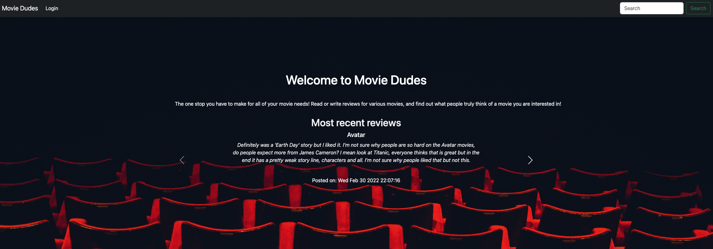

# Movie Dudes Application

## Description: 
 The application allows users to search for movies based on title. The application also allows for the user to register to our app to save movies watched, comment, and read critic reviews.


## User story
```md
As a user, I want to be able to retrieve and add new data using a RESTful API built with Node.js and Express.js. 

The API should use Handlebars.js as the template engine, 
MySQL and the Sequelize ORM for the database, and have both GET and POST routes. 

The API should also use at least one new library or technology, follow the MVC paradigm folder structure, and include authentication using express-session and cookies.

Additionally, the API must protect API keys and sensitive information with environment variables, be deployed on Heroku with data, have a polished UI that is responsive and interactive, meet good-quality coding standards, and have a professional README with a unique name, description, and link to the deployed app.
 ```

 ## Acceptance Criteria
 ```md
The application must be developed using Node.js and Express.js to create a RESTful API.
	
The template engine used in the application must be Handlebars.js.
	
The application must use MySQL and the Sequelize ORM for the database.
	
The application must have both GET and POST routes for retrieving and adding new data.
	
The application must incorporate at least one new library, package, or technology that is not discussed.
	
The folder structure used in the application must adhere to the MVC paradigm.
	
The application must include authentication, which must be implemented using express-session and cookies.

All API keys and sensitive information must be protected with environment variables.
```

[](https://opensource.org/licenses/MIT)

## Link
Link to deployed application on HEROKU.
> https://intense-island-90811.herokuapp.com/


## Table of Contents
  
  * [Installation](#installation)

  * [Technologies](#technologies)

  * [Screenshot](#screenshot)
  
  * [Contributing](#contributing)

  * [Suport](#suport)

  * [Acknowledgement ](#Acknowledgement )
  
  * [Questions](#questions)

  ## Installation
  To install necessary dependencies and start application run the following command:
  
     db folder⬇️
     
     mysql -root -p

     source schema.sql

     root folder⬇️
     
     npm i

     npm run seed

     npm start


## Technologies
1. Javascript
2. NodeJs
3. Express
4. MySql

##  Node modules
     bcrypt
     connect-session-sequelize
     date-fns
     dotenv
     express
     express-handlebars
     express-session
     handlebars
     mysql2
     sequelize
     awesome-notifications

## Screenshot


## Contributing

Contributing
Contributions are welcome! If you would like to contribute to this project, please fork the repository and submit a pull request.

## Support

- [MDN](https://developer.mozilla.org/en-US/) 

- [Google](https://Google.com)


## Acknowledgement 

Authors and acknowledgement: Thank you to all our peers, tutors, T/A's, and instructors that helped me along the way!

## Questions

If you have any questions about this project, please feel free to reach out to me:
  
- [Contact - Full Stack Coder - Iaroslav Lasiichuk](mailto:lasiichuki@gmail.com)
- [Contact - Full Stack Coder - Joseph S. Ortega](mailto:MyAgentOrtega@gmail.com)
- [Contact - Full Stack Coder - Axel Irias](mailto:axel.irias12@gmail.com)
- [Contact - Full Stack Coder - Sutton Charpentier](mailto:uttoncharpentier@gmail.com)